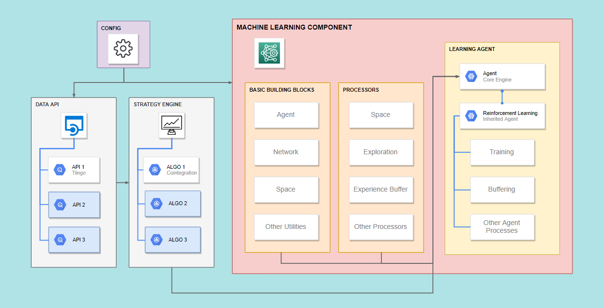

# Pair-Trading-Reinforcement-Learning

  

A TensoFlow implemention in Reinforcement Learning and Pairs Trading. The current status of the project covers implementation of RL in cointegration pair trading based on 1-minute stock market data. For the Reinforcement Learning here we use the N-armed bandit approach. The code is expandable so you can plug any strategies, data API or machine learning algorithms into the tool if you follow the style.

## Guidance

* [Medium](https://medium.com/@wai_i/a-gentle-implementation-of-reinforcement-learning-in-pairs-trading-6cdf8533bced) - The corresponding article for this project.

## Data Source
* [Tiingo](https://www.tiingo.com/) - A financial research platform that provides data including news, fundamentals and prices. We can extract the intraday stock market data through its REST IEX API that retrieves TOPS data (top of book, last sale data and top bid and ask quotes) from the IEX Exchange.

## Examples
See the folder EXAMPLE for more detail. Please initiate your own virtual environment before running the code.

## Disclaimer
The article and the relevant codes and content are purely informative and none of the information provided constitutes any recommendation regarding any security, transaction or investment strategy for any specific person. The implementation described in the article could be risky and the market condition could be volatile and differ from the period covered above. All trading strategies and tools are implemented at the users’ own risk.
